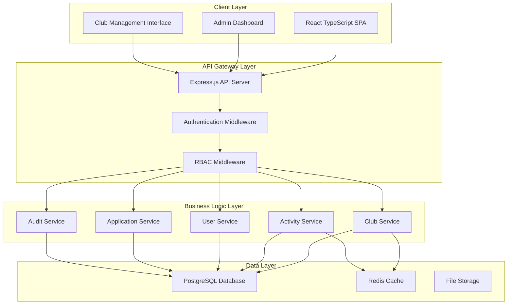

# Design Document: TAU Club and Activity Management System (KAYS)

## Overview

TAU KAYS is a modern web application built with a three-tier architecture featuring a React TypeScript frontend, Node.js Express backend, and PostgreSQL database. The system implements comprehensive Role-Based Access Control (RBAC) with three distinct user roles: Super Admin, Club President, and Student. The architecture emphasizes security, scalability, and maintainability through modern web development practices.

The system provides dynamic club infrastructure creation, real-time content moderation, comprehensive audit logging, and secure authentication mechanisms including two-factor authentication for Super Admins. The design follows RESTful API principles and implements stateless authentication using JWT tokens with refresh token rotation.

## Architecture

### System Architecture



### Technology Stack

**Frontend:**
- React 18 with TypeScript for type safety and modern component architecture
- React Router for client-side routing and dynamic URL generation
- Axios for HTTP client with interceptors for authentication
- Material-UI or Tailwind CSS for consistent UI components
- React Query for server state management and caching

**Backend:**
- Node.js with Express.js framework for RESTful API development
- TypeScript for type safety across the entire stack
- Prisma ORM for database operations and migrations
- JWT with refresh tokens for stateless authentication
- bcrypt for password hashing
- speakeasy for TOTP-based two-factor authentication

**Database:**
- PostgreSQL for primary data storage with ACID compliance
- Redis for session caching and rate limiting
- Database-level RBAC implementation with row-level security

**Infrastructure:**
- Docker containers for consistent deployment
- nginx for reverse proxy and static file serving
- PM2 for Node.js process management
- SSL/TLS encryption for all communications

## Components and Interfaces

### Authentication System

**JWT Token Structure:**
```typescript
interface JWTPayload {
  userId: string;
  role: 'SUPER_ADMIN' | 'CLUB_PRESIDENT' | 'STUDENT';
  clubId?: string; // Only for Club Presidents
  permissions: string[];
  iat: number;
  exp: number;
}
```

**Two-Factor Authentication Flow:**
1. Super Admin enters credentials
2. System validates credentials and generates TOTP secret
3. User scans QR code with authenticator app
4. User enters TOTP code for verification
5. System issues JWT tokens upon successful verification

**Authentication Middleware:**
```typescript
interface AuthMiddleware {
  verifyToken(token: string): Promise<JWTPayload>;
  refreshToken(refreshToken: string): Promise<TokenPair>;
  validateTOTP(userId: string, token: string): Promise<boolean>;
}
```

### Role-Based Access Control (RBAC)

**Permission Matrix:**
```typescript
interface Permission {
  resource: string;
  action: 'CREATE' | 'READ' | 'UPDATE' | 'DELETE';
  scope: 'OWN' | 'ALL' | 'NONE';
}

interface RolePermissions {
  SUPER_ADMIN: Permission[];
  CLUB_PRESIDENT: Permission[];
  STUDENT: Permission[];
}
```

**Database-Level Security:**
- Row-Level Security (RLS) policies for each table
- Separate database roles with minimal required privileges
- Connection pooling with role-based connection strings

### Club Management System

**Club Service Interface:**
```typescript
interface ClubService {
  createClub(clubData: CreateClubRequest): Promise<Club>;
  getClub(clubId: string): Promise<Club>;
  updateClub(clubId: string, updates: UpdateClubRequest): Promise<Club>;
  deleteClub(clubId: string): Promise<void>;
  listClubs(filters: ClubFilters): Promise<Club[]>;
  generateClubUrl(clubName: string): string;
}

interface Club {
  id: string;
  name: string;
  description: string;
  urlSlug: string;
  presidentId: string;
  createdAt: Date;
  updatedAt: Date;
  isActive: boolean;
}
```

**Dynamic URL Generation:**
- URL slug generation from club name with Turkish character support
- Conflict resolution for duplicate slugs
- Automatic routing configuration for new clubs

### Activity Management System

**Activity Service Interface:**
```typescript
interface ActivityService {
  createActivity(clubId: string, activityData: CreateActivityRequest): Promise<Activity>;
  getActivity(activityId: string): Promise<Activity>;
  updateActivity(activityId: string, updates: UpdateActivityRequest): Promise<Activity>;
  deleteActivity(activityId: string): Promise<void>;
  listActivities(clubId: string, filters: ActivityFilters): Promise<Activity[]>;
}

interface Activity {
  id: string;
  clubId: string;
  title: string;
  description: string;
  startDate: Date;
  endDate: Date;
  location: string;
  maxParticipants?: number;
  createdBy: string;
  createdAt: Date;
  updatedAt: Date;
  status: 'DRAFT' | 'PUBLISHED' | 'CANCELLED' | 'COMPLETED';
}
```

### Application Management System

**Application Service Interface:**
```typescript
interface ApplicationService {
  submitApplication(applicationData: CreateApplicationRequest): Promise<Application>;
  getApplication(applicationId: string): Promise<Application>;
  listApplications(clubId: string, filters: ApplicationFilters): Promise<Application[]>;
  updateApplicationStatus(applicationId: string, status: ApplicationStatus, comments?: string): Promise<Application>;
}

interface Application {
  id: string;
  clubId: string;
  studentId: string;
  studentName: string;
  studentEmail: string;
  motivation: string;
  status: 'PENDING' | 'APPROVED' | 'REJECTED';
  submittedAt: Date;
  reviewedAt?: Date;
  reviewedBy?: string;
  reviewComments?: string;
}
```

### Content Moderation System

**Moderation Service Interface:**
```typescript
interface ModerationService {
  flagContent(contentId: string, contentType: string, reason: string): Promise<void>;
  reviewContent(contentId: string, action: 'APPROVE' | 'REJECT' | 'EDIT', changes?: any): Promise<void>;
  getContentQueue(filters: ModerationFilters): Promise<ContentItem[]>;
  getContentHistory(contentId: string): Promise<ContentVersion[]>;
}

interface ContentItem {
  id: string;
  type: 'ACTIVITY' | 'CLUB_INFO' | 'APPLICATION';
  content: any;
  authorId: string;
  clubId: string;
  status: 'PENDING' | 'APPROVED' | 'FLAGGED' | 'REJECTED';
  createdAt: Date;
  flaggedAt?: Date;
  flagReason?: string;
}
```

### Audit Logging System

**Audit Service Interface:**
```typescript
interface AuditService {
  logAction(action: AuditAction): Promise<void>;
  getAuditLog(filters: AuditFilters): Promise<AuditEntry[]>;
  searchAuditLog(query: string): Promise<AuditEntry[]>;
}

interface AuditEntry {
  id: string;
  userId: string;
  userRole: string;
  action: string;
  resource: string;
  resourceId: string;
  changes?: any;
  ipAddress: string;
  userAgent: string;
  timestamp: Date;
  success: boolean;
  errorMessage?: string;
}
```

## Data Models

### Database Schema

**Users Table:**
```sql
CREATE TABLE users (
  id UUID PRIMARY KEY DEFAULT gen_random_uuid(),
  email VARCHAR(255) UNIQUE NOT NULL,
  password_hash VARCHAR(255) NOT NULL,
  role user_role NOT NULL,
  first_name VARCHAR(100) NOT NULL,
  last_name VARCHAR(100) NOT NULL,
  phone VARCHAR(20),
  is_active BOOLEAN DEFAULT true,
  totp_secret VARCHAR(32), -- For 2FA
  totp_enabled BOOLEAN DEFAULT false,
  created_at TIMESTAMP DEFAULT CURRENT_TIMESTAMP,
  updated_at TIMESTAMP DEFAULT CURRENT_TIMESTAMP
);
```

**Clubs Table:**
```sql
CREATE TABLE clubs (
  id UUID PRIMARY KEY DEFAULT gen_random_uuid(),
  name VARCHAR(200) UNIQUE NOT NULL,
  description TEXT,
  url_slug VARCHAR(200) UNIQUE NOT NULL,
  president_id UUID REFERENCES users(id),
  is_active BOOLEAN DEFAULT true,
  created_at TIMESTAMP DEFAULT CURRENT_TIMESTAMP,
  updated_at TIMESTAMP DEFAULT CURRENT_TIMESTAMP
);
```

**Activities Table:**
```sql
CREATE TABLE activities (
  id UUID PRIMARY KEY DEFAULT gen_random_uuid(),
  club_id UUID REFERENCES clubs(id) ON DELETE CASCADE,
  title VARCHAR(300) NOT NULL,
  description TEXT,
  start_date TIMESTAMP NOT NULL,
  end_date TIMESTAMP NOT NULL,
  location VARCHAR(200),
  max_participants INTEGER,
  created_by UUID REFERENCES users(id),
  status activity_status DEFAULT 'DRAFT',
  created_at TIMESTAMP DEFAULT CURRENT_TIMESTAMP,
  updated_at TIMESTAMP DEFAULT CURRENT_TIMESTAMP
);
```

**Applications Table:**
```sql
CREATE TABLE applications (
  id UUID PRIMARY KEY DEFAULT gen_random_uuid(),
  club_id UUID REFERENCES clubs(id) ON DELETE CASCADE,
  student_id UUID REFERENCES users(id),
  student_name VARCHAR(200) NOT NULL,
  student_email VARCHAR(255) NOT NULL,
  motivation TEXT NOT NULL,
  status application_status DEFAULT 'PENDING',
  submitted_at TIMESTAMP DEFAULT CURRENT_TIMESTAMP,
  reviewed_at TIMESTAMP,
  reviewed_by UUID REFERENCES users(id),
  review_comments TEXT
);
```

**Audit Log Table:**
```sql
CREATE TABLE audit_log (
  id UUID PRIMARY KEY DEFAULT gen_random_uuid(),
  user_id UUID REFERENCES users(id),
  user_role user_role NOT NULL,
  action VARCHAR(100) NOT NULL,
  resource VARCHAR(100) NOT NULL,
  resource_id UUID,
  changes JSONB,
  ip_address INET,
  user_agent TEXT,
  timestamp TIMESTAMP DEFAULT CURRENT_TIMESTAMP,
  success BOOLEAN DEFAULT true,
  error_message TEXT
);
```

### Row-Level Security Policies

**Club Access Policy:**
```sql
-- Club Presidents can only access their own club
CREATE POLICY club_president_access ON clubs
  FOR ALL TO club_president
  USING (president_id = current_user_id());

-- Super Admins can access all clubs
CREATE POLICY super_admin_access ON clubs
  FOR ALL TO super_admin
  USING (true);
```

**Activity Access Policy:**
```sql
-- Club Presidents can only manage activities for their club
CREATE POLICY activity_club_access ON activities
  FOR ALL TO club_president
  USING (club_id IN (SELECT id FROM clubs WHERE president_id = current_user_id()));
```

### Data Validation Rules

**Club Validation:**
- Name: 3-200 characters, unique across system
- URL slug: Generated from name, alphanumeric with hyphens
- Description: Optional, max 2000 characters

**Activity Validation:**
- Title: 5-300 characters, required
- Start date: Must be in the future
- End date: Must be after start date
- Max participants: Optional, positive integer

**Application Validation:**
- Student email: Valid email format, required
- Motivation: 50-1000 characters, required
- Student name: 2-200 characters, required

## Correctness Properties

*A property is a characteristic or behavior that should hold true across all valid executions of a system—essentially, a formal statement about what the system should do. Properties serve as the bridge between human-readable specifications and machine-verifiable correctness guarantees.*

### Property 1: Role-based authentication enforcement
*For any* user attempting to authenticate, the system should enforce the appropriate authentication method based on their role: two-factor authentication for Super Admins, standard authentication for Club Presidents, and no authentication required for public content access by Students.
**Validates: Requirements 1.1, 1.2, 1.3, 1.4**

### Property 2: Club creation completeness
*For any* valid club creation request by a Super Admin, the system should atomically create the club record, generate a unique identifier, create the associated Club President account, and generate the club-specific URL path.
**Validates: Requirements 2.1, 2.2, 2.3**

### Property 3: Dynamic URL management consistency
*For any* club in the system, the generated URL should follow the pattern /kulup/{club-slug}, route correctly to the club's public interface, and maintain consistency across all clubs.
**Validates: Requirements 3.1, 3.3, 3.4**

### Property 4: Resource cleanup completeness
*For any* club deletion operation, the system should remove all associated resources including URLs, activities, applications, and database records while maintaining referential integrity.
**Validates: Requirements 3.5, 12.5**

### Property 5: Role-based access control enforcement
*For any* user and any system resource, access should be granted only if the user's role has the appropriate permissions for that resource, with Club Presidents restricted to their assigned club and Students restricted to public content.
**Validates: Requirements 4.1, 4.5, 5.5, 10.2**

### Property 6: Activity management with club association
*For any* activity operation (create, update, delete) by a Club President, the activity should be correctly associated with their assigned club and no other club.
**Validates: Requirements 4.2, 7.2**

### Property 7: Application workflow completeness
*For any* student application submission, the system should store the application with complete metadata, make it visible to the relevant Club President, and maintain the application throughout its lifecycle.
**Validates: Requirements 5.3, 8.1, 8.2**

### Property 8: Content moderation accessibility
*For any* content created in the system, Super Admins should be able to immediately access, review, modify, or remove that content regardless of which club or user created it.
**Validates: Requirements 6.1, 6.3, 6.4**

### Property 9: Comprehensive audit logging
*For any* user action in the system, the action should be logged with complete metadata including user ID, timestamp, action details, and for content modifications, both before and after states.
**Validates: Requirements 9.1, 9.2, 9.3**

### Property 10: Database-level security enforcement
*For any* database query, the system should enforce role-based access control at the database level using appropriate connection privileges and row-level security policies.
**Validates: Requirements 10.1, 10.3, 10.4**

### Property 11: Data encryption and protection
*For any* sensitive data stored in the system, including authentication credentials and personal information, the data should be properly encrypted using industry-standard encryption methods.
**Validates: Requirements 10.5**

### Property 12: Input validation and sanitization
*For any* user input to the system, the input should be validated against appropriate rules for the data type and sanitized to prevent security vulnerabilities, with invalid input being rejected.
**Validates: Requirements 12.1, 12.2, 12.4**

### Property 13: Notification delivery consistency
*For any* application status change, the system should deliver notifications to the affected student using the contact information provided in their application.
**Validates: Requirements 8.4**

### Property 14: Activity chronological ordering
*For any* club's public page, activities should be displayed in chronological order based on their start dates.
**Validates: Requirements 7.3**

### Property 15: Automatic status management
*For any* activity with an end date in the past, the system should automatically mark it as completed while retaining all activity data.
**Validates: Requirements 7.5**

### Property 16: Caching consistency
*For any* cached data in the system, the cached version should remain consistent with the source data, and cache invalidation should occur when the source data changes.
**Validates: Requirements 11.5**

### Property 17: Suspicious activity detection
*For any* sequence of user actions that matches suspicious activity patterns, the system should flag the activity and alert Super Admins for review.
**Validates: Requirements 9.5**

## Error Handling

### Authentication Errors
- **Invalid Credentials**: Return standardized error response without revealing whether username or password is incorrect
- **2FA Failures**: Implement rate limiting and account lockout after multiple failed attempts
- **Token Expiration**: Graceful token refresh with fallback to re-authentication
- **Session Hijacking**: Detect and invalidate suspicious sessions

### Authorization Errors
- **Insufficient Permissions**: Return 403 Forbidden with minimal information about the resource
- **Resource Not Found**: Return 404 for resources that don't exist or user lacks access to
- **Cross-Club Access**: Log unauthorized access attempts and return generic error

### Data Validation Errors
- **Input Validation**: Return detailed field-level validation errors for client-side display
- **Business Rule Violations**: Return specific error messages for business logic failures
- **Database Constraints**: Handle unique constraint violations and foreign key errors gracefully

### System Errors
- **Database Connection**: Implement connection pooling with retry logic and circuit breakers
- **External Service Failures**: Graceful degradation when notification services are unavailable
- **File System Errors**: Handle file upload and storage failures with appropriate cleanup

### Error Response Format
```typescript
interface ErrorResponse {
  error: {
    code: string;
    message: string;
    details?: any;
    timestamp: string;
    requestId: string;
  };
}
```

## Testing Strategy

### Dual Testing Approach

The system will implement both unit testing and property-based testing as complementary approaches:

**Unit Tests** focus on:
- Specific examples and edge cases
- Integration points between components
- Error conditions and exception handling
- Mock external dependencies for isolated testing

**Property Tests** focus on:
- Universal properties that hold for all inputs
- Comprehensive input coverage through randomization
- Validation of business rules across diverse scenarios
- Security and authorization rules enforcement

### Property-Based Testing Configuration

**Testing Framework**: fast-check for JavaScript/TypeScript property-based testing
**Test Configuration**: Minimum 100 iterations per property test to ensure comprehensive coverage
**Test Tagging**: Each property test tagged with format: **Feature: tau-kays, Property {number}: {property_text}**

### Unit Testing Strategy

**Framework**: Jest with TypeScript support
**Coverage Requirements**: Minimum 80% code coverage for critical paths
**Test Organization**: Tests organized by service layer with separate test files for each component

**Key Unit Test Areas**:
- Authentication middleware with various token scenarios
- RBAC permission checking with different role combinations
- Input validation with boundary conditions
- Database operations with transaction rollback scenarios
- URL generation with Turkish character handling
- Error handling with various failure modes

### Integration Testing

**API Testing**: Supertest for HTTP endpoint testing
**Database Testing**: Test database with Docker containers for isolation
**End-to-End Testing**: Playwright for critical user workflows

### Security Testing

**Authentication Testing**: Test 2FA implementation, token handling, and session management
**Authorization Testing**: Verify RBAC enforcement across all endpoints
**Input Security Testing**: Test for SQL injection, XSS, and other injection attacks
**Rate Limiting Testing**: Verify rate limiting and DDoS protection mechanisms

### Performance Testing

**Load Testing**: Artillery.js for API load testing
**Database Performance**: Test query performance with large datasets
**Caching Effectiveness**: Verify cache hit rates and performance improvements

### Test Data Management

**Test Fixtures**: Standardized test data for consistent testing
**Data Cleanup**: Automatic cleanup of test data after test execution
**Database Seeding**: Automated seeding for integration and E2E tests